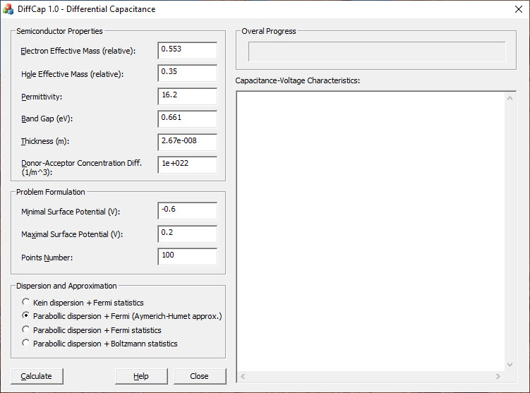

# Differential capacitance calculation

This software performs calculation of the [differential capacitance](https://en.wikipedia.org/wiki/Differential_capacitance) of semiconductor thin film.  
Differential capacitance can be directly measured experimentally. Moreover, it is closely related to both the internal properties of the semiconductor,
for example, the dispersion relation, and its geometric parameters. 

Thin film is considered in the framework of phenomenological theory of the space charge region, hence quantum effects are taken into account only in the Fermi-Dirac statistics. Dimensional quantization effects are not considered. 

Code was written mainly in 2011 year. Calculations were performed using [GSL](https://www.gnu.org/software/gsl/) library (GSL 1.14). GUI is based on [MFC](https://docs.microsoft.com/en-us/cpp/mfc/mfc-desktop-applications?view=msvc-160) application which was built with Visual Studio 2010.  

Results were published in "[On the Field Effect in Thin Films of Semiconductors
with Kane’s Charge Carrier Dispersion Relation](https://link.springer.com/article/10.1134/S1063782614030117)". 

Initial algorithm was published in ["Differential capacitance of a semiconductor film"](https://link.springer.com/article/10.1134/S106378261010009X).

## User interface

Results and overall calculation progress are shown on the right panel. 

The section on the left is divided into three areas: **Semiconductor Properties** where material parameters should be entered; **Problem Formulation** for problem setup;   and **Dispersion and Approximation** for choosing the dispersion law of carriers, the type of statistics and used approximations. Detailed description of the each field can be found below.

  

### Semiconductor Properties

`Electron effective mass (relative)` - the ratio of the effective mass of an electron in the conduction band to the mass of a free electron

`Hole effective mass (relative)` - the ratio of the effective mass of a hole in the valence band to the mass of a free electron

`Permittivity` - relative dielectric constant

`Band gap` - band gap in electron volts (eV)

`Thickness` - the thickness of the semiconductor film in meters

`Donor-Acceptor concentration diff` - the difference between donor and acceptor concentrations. It is suggested that donors and acceptors are fully ionized and uniformly distributed throughout the film. For an n-type semiconductor, this value is positive,  for a p-type semiconductor, it is negative. For an intrinsic semiconductor (or a compensated one), it equals zero

### Problem Formulation

`Minimal surface potential (V)` - minimum surface potential in volts

`Maximal surface potential (V)` - maximum surface potential in volts

`Points number` - the number of points where the surface differential capacitance will be calculated

### Dispersion and Approximation

Here user can select the dispersion law of charge carriers, their statistics and approximations used during calculation

`Kein dispersion + Fermi statistics` - Kein (relativistic) dispersion and Fermi-Dirac statistics will be used in the calculations

`Parabolic dispersion + Fermi (Aymerich-Humet approximation)` - parabolic dispersion  and Fermi-Dirac statistics. To speed up the calculations, the [Aymerich-Humet approximation](https://www.sciencedirect.com/science/article/abs/pii/0038110181901210) of the Fermi-Dirac integral of 1/2 order is used. Its maximal error is about 0.5 %

`Parabolic dispersion + Fermi statistics` - parabolic dispersion and Fermi-Dirac statistics. Fermi-Dirac integral approximations are not used

`Parabolic dispersion + Boltzmann statistics` - Parabolic dispersion law and Boltzmann statistics. Suitable for non-degenerate semiconductors

