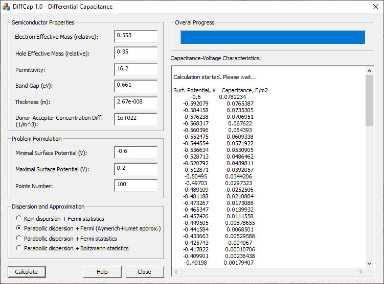

# Differential capacitance calculation

This software performs calculation of the differential capacitance of semiconductor thin film.  
Differential capacitance can be directly measured experimentally. Moreover it is closely related to both the internal properties of the semiconductor,
for example, the dispersion relation, and its geometric parameters. 

The phenomenological theory of the space charge region is used, that is, quantum effects are taken into account only in the Fermi-Dirac statistics.
Dimensional quantization effects are not considered. 

Code was written mainly in 2011 year. Calculations were performed using [GSL](https://www.gnu.org/software/gsl/) library (GSL 1.14). GUI is based on MFC application which was built with Visual Studio 2010.  

Results were published in "[On the Field Effect in Thin Films of Semiconductors
with Kane’s Charge Carrier Dispersion Relation](https://link.springer.com/article/10.1134/S1063782614030117)". 

Initial algorithm was published in ["Differential capacitance of a semiconductor film"](https://link.springer.com/article/10.1134/S106378261010009X).

## User interface

  

